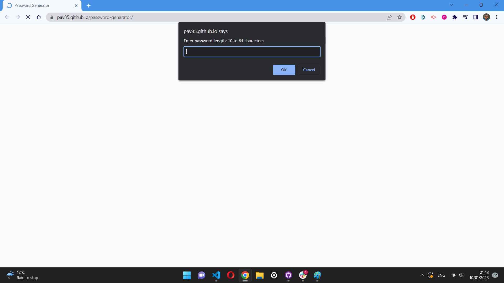

# password-genarator

## Description

Password generator in JavaScript

## Installation

After opening this url: https://pav85.github.io/password-genarator/ you should see this:

## Functionality

The app generates random password using series of prompts in the beginning to define:

- password length (between 10 and 64 characters)
- if special characters will be used
- if numeric characters will be used
- if lowercase characters will be used
- if uppercase characters will be used

Once all the information is entered when red button "Generate password" is clicked, the password is generated in a box.

Red button can be pressed multiple times

## Credits

N/A

## Licence

MIT License
