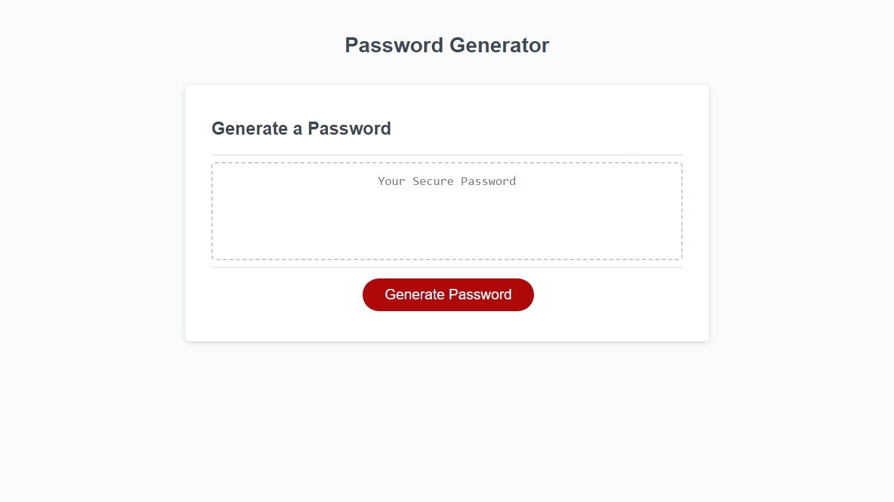

# Password Generator

## Overview

This JavaScript-based Password Generator is a user-friendly tool designed to create secure and customizable passwords. It offers a range of options, allowing users to specify the length and types of characters used in the generated password.

Visit the live application here: [Password Generator](https://pav85.github.io/password-genarator/)

## Features

Upon accessing the application, users are guided through a series of prompts to configure their password preferences:

- **Password Length:** Choose between 10 to 64 characters.
- **Character Types:** Opt to include any combination of:
  - Lowercase characters (a-z)
  - Uppercase characters (A-Z)
  - Numeric characters (0-9)
  - Special characters (e.g., @, #, $)
  
  

After preferences are set, clicking the "Generate password" button produces a random password that appears in a designated text box. This button can be used repeatedly to generate new passwords.

## Screenshot

## Installation

No installation required. Simply navigate to the [Password Generator](https://pav85.github.io/password-genarator/) webpage to start using the application.

## Usage

1. **Set Preferences:** Upon loading the page, respond to the prompts to configure your password.
2. **Generate Password:** Click the red "Generate password" button.
3. **View and Use Password:** Your newly generated password will be displayed in the text box. Copy and use it as needed.

## Contributing

Contributions, ideas, and feedback are welcome. For major changes, please open an issue first to discuss what you would like to change.

## License

This project is licensed under the MIT License - see the [LICENSE](LICENSE) file for details.
